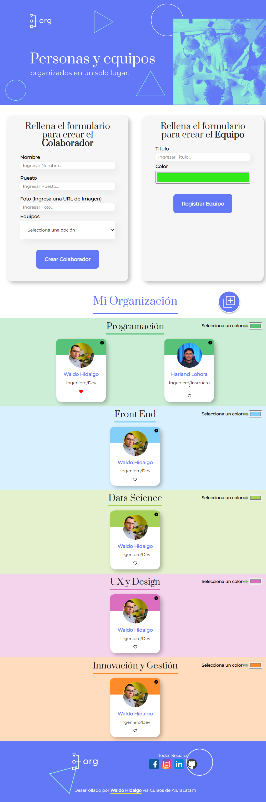
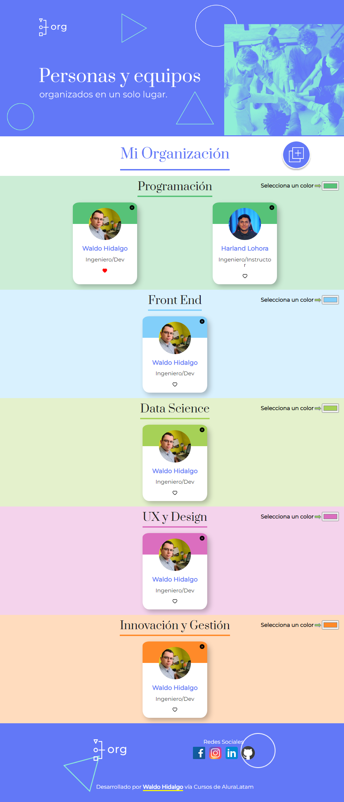
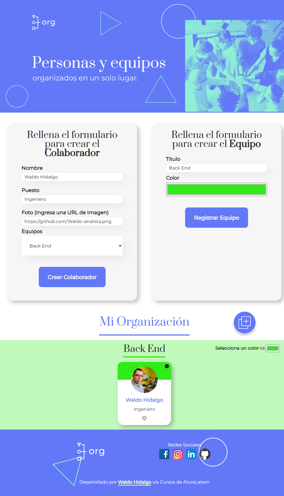
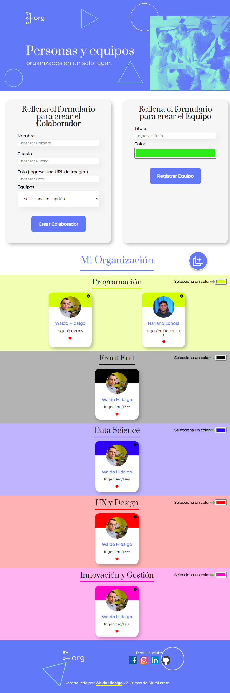
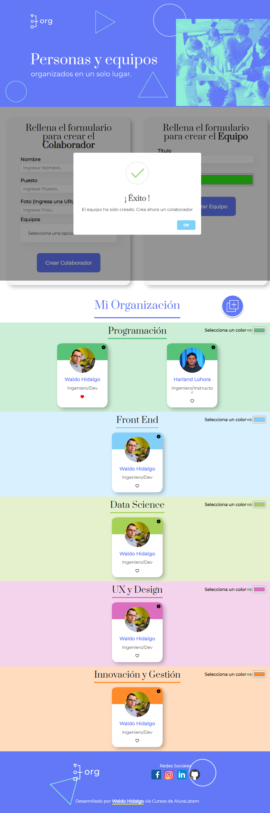

# Proyecto Organización Colaboradores usando React.js

This project was bootstrapped with [Create React App](https://github.com/facebook/create-react-app).
Este es el proyecto de práctica y aplicación de la librería React.js que se presenta en los dos primeros cursos de la formación React ONE G-5 del programa Oracle Next Education. Dichos cursos se denominan:

<ol>
  <li><strong>React: desarrollando con JavaScript</strong></li>
  <li><strong>React: como los componentes funcionan</strong></li>
</ol>

Los cursos son dictados por el instructor [Harland Lohora](https://github.com/HarlandLohora). El instructor domina muy bien el tópico objeto de enseñanza y además sus explicaciones son muy didácticas, su proceso de enseñanza el cual consiste en realizar y explicar todo lo que hace, facilita el ir replicando sus pasos y aprender haciendo. Sin embargo, para seguirle el ritmo, es necesario tener un cierto background sobre JavaScript en temas fundamentales para encontrarle sentido y utilidad a lo que hace. Recomiendo 100% al instructor Harland.

He seguido los pasos del instructor y he recreado 100% el proyecto del curso. Además, he dado diseño responsive a la página y he agregado algunos aspectos visuales adicionales. He desplegado el proyecto en render.com desde un repositorio en el cual tengo el código tal y como lo tengo en local y render se encarga de build el proyecto. El link del proyecto es: [Proyecto Organización desplegado en Render](https://aluraorg.onrender.com/).

También he desplegado el proyecto en Vercel.com construyendo el build en local y subiendolo a un [repositorio](https://github.com/Waldo-analista/orgdeployalternativo) en mi github luego lo he desplegado en Vercel y el link es el siguiente: [Proyecto Organización desplegado en Vercel](https://colaborador-org.vercel.app/)

El proyecto consiste en la creación de una herramienta para mostrar colaboradores según el área de la organización en que se desempeñe. Se practican muchos conceptos entre ellos respecto a React mismo ya sea: sintaxis JSX, elementos, componentes, estados, hooks, pasar datos entre componentes e instalación y uso de dependencias. También se practican conceptos de JavaScript mismo ya sea: Métodos Map y Filter, spread operator(...), desempaquetamiento de atributos de objetos (destructuring assignment), asignación de un valor por defecto en la destructuracion de objetos cuando un atributo es undefined, uso del operador && el cual devuelve el primer valor falsy que encuentre o el último valor si todos son truthy.

A continuación muestro screenshots del proyecto:

## Proyecto completo:

Imagen del proyecto completo con los formularios mostrados

Imagen del proyecto completo sin los formularios mostrados

## Creación de Equipo y Colaborador:

## Funcionalidad Like y Cambio de Colores:

## Uso de la librería SweetAlert:

